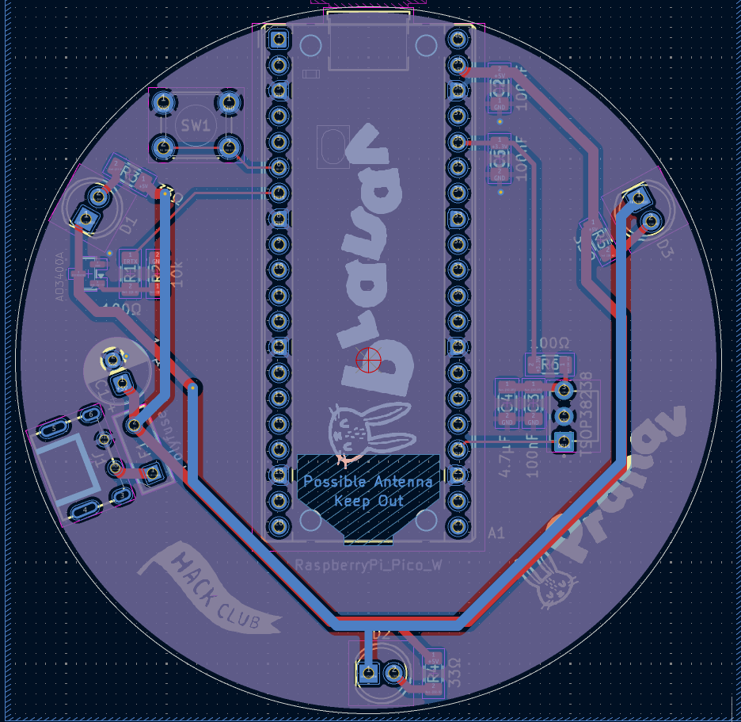

# EchoIR

This is an IR hub, with both an IR receiver and a handful of transmitters, which can control my IR appliances, like the AC, fan, and TV, with my phone and over the internet. It wouldn't replace the remotes, but it could learn their signals and replay them whenever I want from my phone.

# Schematic
*Made in KiCad*

On the left side is the USB-C connector, going into the polyfuse, then into the +5V rail. The three IR LEDs each have their own 33-ohm resistor and connect from +5V to the IRLEDNODE. When the MOSFET turns on, current flows through all three LEDs to ground. The TSOP38238 receiver runs from +3.3V, which comes from the Pico's internal regulator. There is a 100nF capacitor and a 4.7uF capacitor close to it, because IR receivers are sensitive to noise. The button connected to GPIO 14 controls the "record" mode, with its status led just being the inbuild Pi led at GPIO25.

# PCB
*Made in KiCad*

