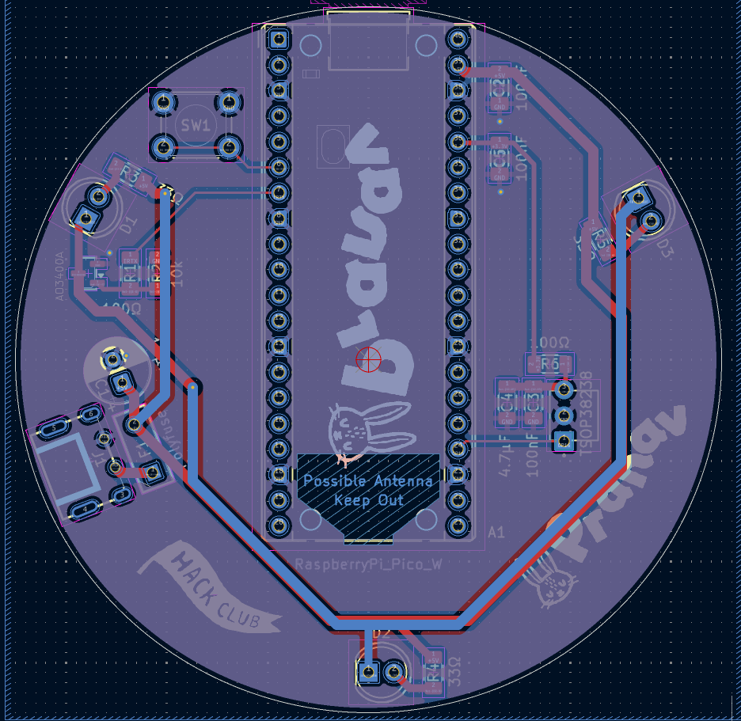

# EchoIR

This is an IR hub, with both an IR receiver and a handful of transmitters, which can control my IR appliances, like the AC, fan, and TV, with my phone and over the internet. It wouldn't replace the remotes, but it could learn their signals and replay them whenever I want from my phone.

# Schematic
*Made in KiCad*

On the left side is the USB-C connector, going into the polyfuse, then into the +5V rail. The three IR LEDs each have their own 33-ohm resistor and connect from +5V to the IRLEDNODE. When the MOSFET turns on, current flows through all three LEDs to ground. The TSOP38238 receiver runs from +3.3V, which comes from the Pico's internal regulator. There is a 100nF capacitor and a 4.7uF capacitor close to it, because IR receivers are sensitive to noise. The button connected to GPIO 14 controls the "record" mode, with its status led just being the inbuilt Pi led at GPIO25.

# PCB
*Made in KiCad*

# Firmware
*Written in CircuitPython*

The Pico 2W connects to WiFi on boot and starts a HTTP server that exposes a simple webhook endpoint. When I press the button, it enters a short recording window and captures the raw pulse timings from the TSOP38238, then stores them in memory with an incrementing ID number. The IR LEDs are driven from GPIO5 using a 38kHz PWM carrier, and when a POST request is sent to `/play` with a JSON body like `{"id": 3}`, the Pico looks up that stored signal and replays it through the three IR transmitters. Everything runs locally on the Pico, so another computer on the same network can trigger appliances just by sending a simple HTTP request. This can also be easily plugged in to home automation services, or be modified to worth with MQTT, something I plan to do in the future.

# CAD Base
*Designed in Fusion 360*

Created a basic CAD base for the PCB to sit on. I did not create any top cover, since the LEDs cannot shine through solid PLA plastic, neither can the TSOP recieve IR pulses. This is just to prevent the bottom pins from scratching the surface I put this on.

